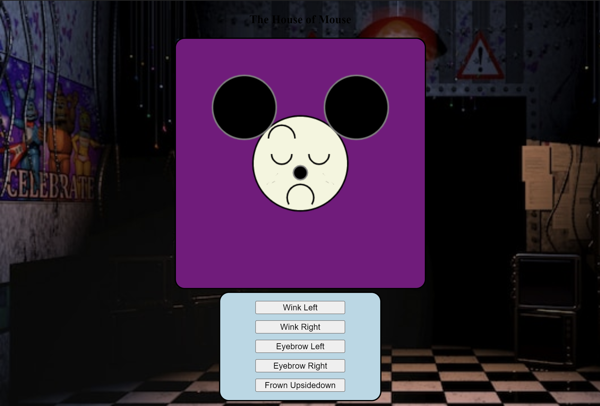
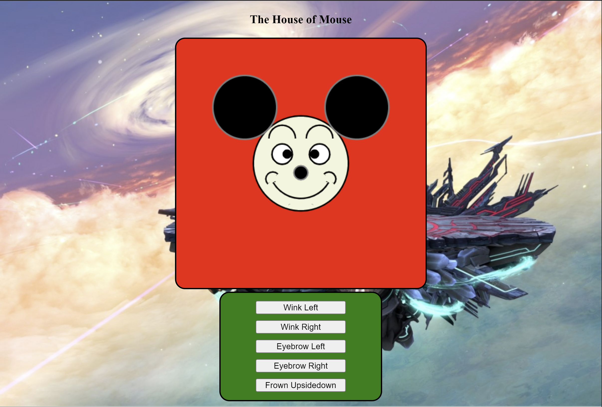

"https://codepen.io/ifrair729/pen/PoVVbpr?editors=0010"

# Littleton Project Coding I

*step 1 play with the buttons* 
1. Click the buttons and make Mickey do a random face

*step 2 change background color and background image 1*

a. Look in the code and find the line in the CSS section find #myCanvas{}  and change the color after the line "background-color" to light blue    
b. Look in the code to find the line in the CSS section under #remote{} and change the color after the line "background-color" to orange   
c. Change the background image of the body to the disney background in the CSS section background-image: url('') between the single quotes add the link below.
"https://c4.wallpaperflare.com/wallpaper/971/593/287/disneyland-walt-disney-disney-wallpaper-preview.jpg"    
d. Change Mickey's face so that is matches the first example image.   
 { width: 200px; }

*step 3 change background color and background image 2*   

a. Look in the code and find the line in the CSS section find #myCanvas{}  and change the color after the line "background-color" to purple      
b. Look in the code to find the line in the CSS section under #remote{} and change the color after the line "background-color" to lightblue      
c. Change the background image of the body to the disney background in the CSS section background-image: url('') between the single quotes add the link below.   
https://static.wikia.nocookie.net/freddy-fazbears-pizza/images/f/f8/The_Office_2_No_Flashlight.png/revision/latest?cb=20141126225944   

d. Change Mickey's face so that is matches the second example image.   

*step 4 change background color and background image 2*   
a. Look in the code and find the line in the CSS section find #myCanvas{}  and change the color after the line "background-color" to red   
b. Look in the code to find the line in the CSS section under #remote{} and change the color after the line "background-color" to green   
c. Change the background image of the body to the disney background in the CSS section background-image: url('') between the single quotes add the link below.   
d. Change Mickey's face so that is matches the second example image.   
   

*step 5 use the previous acquire knowledge and implement it*   
a. With the previous knowledge change the background color or image and make mickey do a different face.